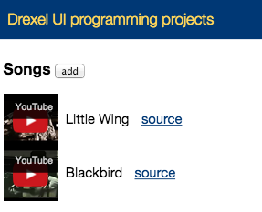
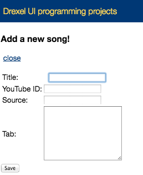

# Overview
This is a project for storing music for guitar songs, and being able to listen to the song while reading the music.

# UI sketch:
- 
- 

# Setup
See [../README.md](../README.md) for setup information.

# Project folder structure
- [server.js](server.js) - the server program, written in JavaScript and run with `node server.js`
- [public/index.html](public/index.html) - the main HTML file
- [public/stylesheets/v5.css](public/stylesheets/v5.css) - the CSS for the project
- [src/main.js](src/main.js) - the entry point for the JavaScript browser program
- [src/images/](src/images/) - the folder for any images in the project (none now)
- [src/dist/bundle.js](src/dist/bundle.js) - the place where `npm run-script build` will put the compiled and packaged JavaScript file for the browser.
- [package.json](package.json) - the file describing other libraries this projects uses.  When you run `npm install` it reads this to install everything for you.
- [node_modules](node_modules) - when you run `npm install`, it downloads all the libraries the project needs and puts them in this folder. You shouldn't ever edit it directly.

# Interacting with the server using curl
See the comments in [server.js](server.js) for information about the server's API and how you can get the list of songs, or can add new songs.  Here's an example of the kind of requests we were making with `curl` during class:

```
# Get the list of songs from the server
curl -X GET -i http://localhost:3055/songs

# Post a new song
curl -H "Content-Type: application/json" -X POST -i http://localhost:3055/songs -d '{"title":"Blackbird","artist":"The Beatles","youTubeId":"BrxZhWCAuQw","source":"http://tabs.ultimate-guitar.com/b/beatles/blackbird_ver5_tab.htm","text":"blah... music... blah..."}'

# Star a song (works as a counter, think Facebook "Likes")
# This will add 1 star the song with the id `seeded_1`:
curl -X POST -i http://localhost:3055/songs/seeded_1/star
```

# Errors on the Web inspector console.
This is related to embedding the YouTube video, and from Googling around it looks like it's a known bug in Chrome, and that Google's current plan is not to fix this bug. :(
See [https://code.google.com/p/google-cast-sdk/issues/detail?id=309](https://code.google.com/p/google-cast-sdk/issues/detail?id=309) for more information.
